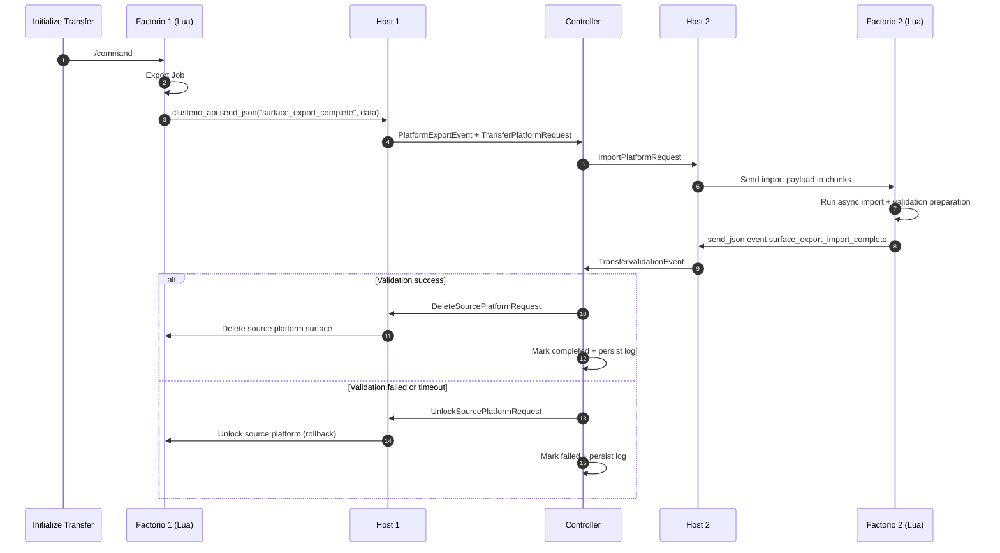
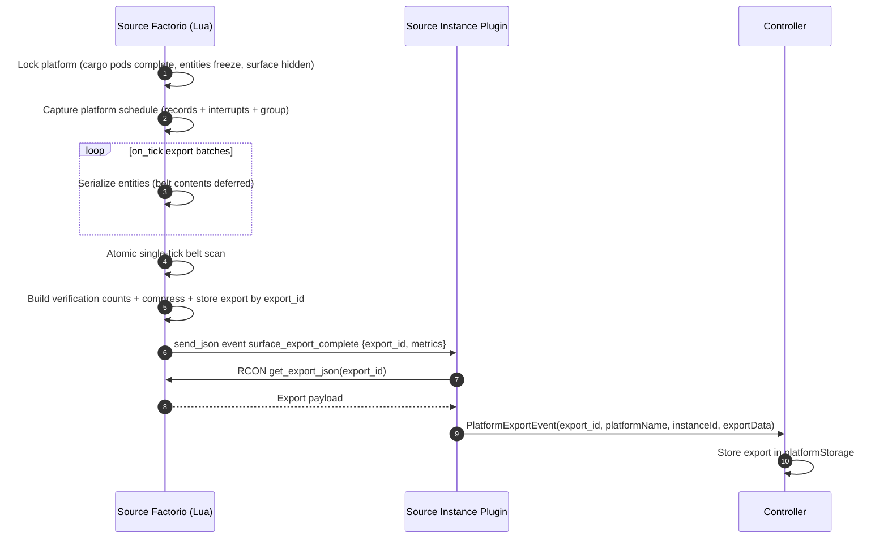
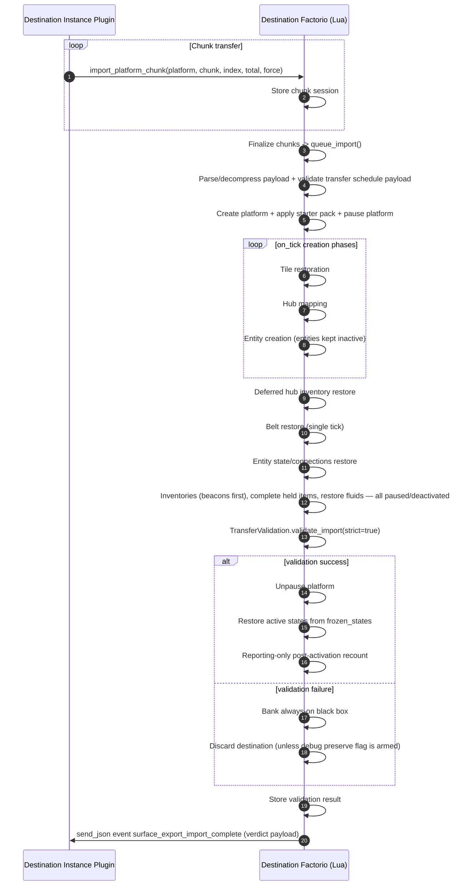

# Platform Export/Import Flow: Complete Action Trace

Step-by-step action breakdown of the export, import, and transfer flows, with the
real message names, send_json channels, remote-interface calls, and file/handler
locations to use when tracing or debugging an operation. (Absorbed the former
`TRANSFER_WORKFLOW_GUIDE.md` and `TRANSFER_CODE_PATHS.md`.)

All plugin paths below are relative to
`docker/seed-data/external_plugins/surface_export/`. All Lua `require` paths inside
the save-patched module use the `modules/surface_export/...` prefix.

## Table of Contents

- [Transfer Sequence Diagrams](#transfer-sequence-diagrams)
- [Surface Lock Mechanism](#surface-lock-mechanism)
- [Export Flow: Instance to Controller](#export-flow-instance-to-controller)
- [Import Flow: Controller to Instance](#import-flow-controller-to-instance)
- [Transfer Flow: Instance to Instance](#transfer-flow-instance-to-instance)
- [Validation Summary](#validation-summary)
- [Transaction Log Tracking](#transaction-log-tracking)
- [Code Reference Map](#code-reference-map)
- [Architecture Notes](#architecture-notes)
- [Debug Commands](#debug-commands)

## Transfer Sequence Diagrams

### Canonical end-to-end transfer



### Export internals (source side)



### Import internals (destination side)



## Surface Lock Mechanism

A platform is locked while it is being exported or transferred so its entities are
not modified mid-scan. Locking freezes every activatable entity (recording each
entity's original `active` state so import can restore it), completes in-flight cargo
pods, hides the surface from players, and captures the platform schedule.

| Operation | Function | Storage key |
|-----------|----------|-------------|
| Lock | `SurfaceLock.lock_platform(platform, force, transfer_opts?)` | `storage.locked_platforms[platform.index]` (unique index, NOT name) |
| Unlock | `SurfaceLock.unlock_platform(platform_index, expected_name?)` | (removes the same entry; `expected_name` is a display tripwire only) |
| Check | `SurfaceLock.is_locked(platform_index)` | — |
| Activate after validation | `SurfaceLock.activate_all(surface)` | — |
| Transfer-lock expiry (source-side TTL) | `SurfaceLock.scan_transfer_expiries()` (on_tick, `%60`) | auto-unlocks expired `kind="transfer"` and `kind="export"` locks |

`lock_platform` returns `false` with `"Platform already locked"` if the platform is
already locked. The lock record stores `frozen_states` (entity id → original active
state), `original_hidden`, `original_schedule`, `surface_index`, and `locked_tick`.
Lock state lives in `storage`, so it survives save/load.

For export-only operations the source platform is unlocked after the export
completes. For transfers the source stays locked until cleanup (delete or unlock)
runs after the destination import is validated.

**File**: `module/utils/surface-lock.lua`

```powershell
# View locked platforms
./tools/rcon.ps1 11 "/sc for name, data in pairs(storage.locked_platforms or {}) do game.print(name) end"

# Force unlock one platform (use with caution)
./tools/rcon.ps1 11 "/unlock-platform <platform_name>"
```

## Export Flow: Instance to Controller

### 1. Queue the export (in Factorio)

An export is queued by the `/export-platform <index> [destination_instance_id]`
command (`module/interfaces/commands/export-platform.lua`) or by the
`ExportPlatformRequest` message handled on the instance plugin
(`instance.ts` → `handleExportPlatformRequest` → `exportPlatform`).

Both paths reach `AsyncProcessor.queue_export(platform_index, force_name,
player_name, destination_instance_id)`. When `destination_instance_id` is `nil`,
the job is export-only; when set, it is a transfer (the destination is carried
through to completion).

The instance plugin's `exportPlatform()` calls the Lua remote interface over RCON:

```text
remote.call("surface_export", "export_platform", platformIndex, forceName, targetArg)
```

`targetArg` is `"nil"` for export-only and the numeric instance id for a transfer
(`exportPlatform` only treats a positive integer as a transfer destination).

### 2. Async export processing (in Factorio)

The export job is processed across multiple ticks by the async processor and export
pipeline. Entity structure, inventories, fluids, and tiles are scanned in batches;
belt-item extraction is deferred to a single atomic pass at completion (see the
belt-scan note in CLAUDE.md, Pitfall #16). On completion the serialized export is
stored in the mod and the plugin is notified via the `surface_export_complete`
send_json channel.

```
AsyncProcessor.process_tick()                 [core/async-processor.lua]
  → ExportPipeline.process_batch()            [core/export-pipeline.lua]  (each tick until complete)
      → EntityScanner.scan_surface()          [export_scanners/entity-scanner.lua]
      → entity-handlers.lua                   (belt items deferred — skip_belt_items flag)
  → ExportPipeline.complete()                 (single tick, after all entities scanned)
      → atomic belt scan (extract_belt_items for all tracked belt entities)
      → Verification counts from the consistent serialized data
      → clusterio_api.send_json("surface_export_complete", data)
```

**Files**: `module/core/async-processor.lua`, `module/core/export-pipeline.lua`

### 3. Instance plugin receives the export

`instance.ts` registers `this.i.server.handle("surface_export_complete",
this.handleExportComplete.bind(this))`. `handleExportComplete`:

1. Reads the full serialized export from Lua via
   `remote.call("surface_export", "get_export_json", exportId)` (`getExportData`).
2. Sends it to the controller with a **`PlatformExportEvent`**
   (`exportId`, `platformName`, `instanceId`, `exportData`, `timestamp`,
   `exportMetrics`).
3. If `destination_instance_id` is present in the payload, it then sends a
   **`TransferPlatformRequest`** to the controller to start the transfer (unless the
   export was already controller-managed, tracked in
   `controllerManagedTransferExports`).

**File**: `instance.ts` (`handleExportComplete`)

### 4. Controller stores the export

`controller.ts` registers `this.c.handle(messages.PlatformExportEvent,
this.handlePlatformExport.bind(this))`. `handlePlatformExport` stores the export in
the in-memory `platformStorage` map (keyed by `exportId`), enforces the
`surface_export.max_storage_size` cap (`cleanupOldExports`), then persists storage to
disk and queues a platform-tree broadcast.

Storage is an in-memory `Map` persisted as a single JSON file under the controller's
`controller.database_directory` (see [Code Reference Map](#code-reference-map)), not
one file per export.

**File**: `controller.ts` (`handlePlatformExport`)

### Export-for-download variant

The web UI / `clusterioctl` "export for download" path sends an
**`ExportPlatformForDownloadRequest`** to the controller
(`handleExportPlatformForDownloadRequest`), which forwards an `ExportPlatformRequest`
with `targetInstanceId: null` to the source instance, waits for the export to be
stored (`orchestrator.waitForStoredExport`), and returns the stored export data in
the response for the browser to download.

## Import Flow: Controller to Instance

### Upload-import (JSON file uploaded through the UI)

1. The control connection sends an **`ImportUploadedExportRequest`** to the
   controller (`handleImportUploadedExportRequest`).
2. The controller creates an `import` operation record, injects `_operationId` into
   the payload, and forwards an **`ImportPlatformRequest`** to the target instance.
3. The instance plugin's `handleImportPlatformRequest` calls `importPlatform`, which
   sends the data to Lua in 100 KB chunks (`RCON_CHUNK_SIZE` in `helpers.ts`) via the
   `remote.call("surface_export", "import_platform_chunk", platform_name, chunk,
   index, total, force_name)` interface (`sendChunkedJson` in `helpers.ts`).
4. When all chunks arrive, `import-platform-chunk.lua` reassembles the JSON and calls
   `AsyncProcessor.queue_import(...)`.
5. On completion Lua emits the `surface_export_import_complete` send_json event. The
   instance forwards an **`ImportOperationCompleteEvent`** (carrying `operationId`) to
   the controller so non-transfer imports complete their transaction log
   (`handleImportOperationCompleteEvent`).

**Files**: `controller.ts` (`handleImportUploadedExportRequest`,
`handleImportOperationCompleteEvent`), `instance.ts` (`handleImportPlatformRequest`,
`importPlatform`, `handleImportCompleteValidation`),
`module/interfaces/remote/import-platform-chunk.lua`

### Import from a file on disk

`/plugin-import-file <file> <name>` (and the `ImportPlatformFromFileRequest` message)
route to `instance.ts` → `importPlatformFromFile`. Because Factorio 2.0 Lua cannot
read files, Node reads the file from the instance's `script-output/` directory and
sends it to Lua through the same `import_platform_chunk` interface.

**File**: `instance.ts` (`importPlatformFromFile`)

### Async import processing and validation (in Factorio)

The import job runs across multiple ticks. The post-placement phase ordering is
critical (hub inventories, belt items, entity state, beacon activation, two-pass
inventory restoration, held-item completion, frozen fluid restoration, exact validation, activation, reporting) and
is documented in CLAUDE.md under "Import Phase Ordering (Critical)". On completion
the mod emits `surface_export_import_complete` with validation and import metrics.

```
AsyncProcessor.process_tick()                     [core/async-processor.lua]
  → ImportPipeline.process_batch()                [core/import-pipeline.lua]  (async, multiple ticks)
      → Phase-0 force sync (raise-only inserter bonuses — Pitfall #29, dest-force research replication)
      → TileRestoration.process()                 [import_phases/tile_restoration.lua]
      → EntityCreation.process_batch()            [import_phases/entity_creation.lua]  (entities kept inactive)

ImportCompletion.run_phase1()  (single tick)      [core/import-completion.lua]
  → PlatformHubMapping.restore_hub_inventories()  [import_phases/platform_hub_mapping.lua]
  → BeltRestoration.restore()                     [import_phases/belt_restoration.lua]
  → EntityStateRestoration.restore_all()          [import_phases/entity_state_restoration.lua]
  → job.pending_beacon_tick = tick + 1            (wait 1 tick → Phase 2)

ImportCompletion.run_phase2()  (single tick)      [core/import-completion.lua]
  → Deserializer.restore_inventories()  PASS 1: beacons only     [core/deserializer.lua]
     (beacon_modules populated → crafting_speed updates immediately)
  → Deserializer.restore_inventories()  PASS 2: all other entities
     (set_stack cap now uses beacon-boosted crafting_speed)
  → deactivate all entities, re-pause platform
  → ActiveStateRestoration.restore_held_items_only()   (single owner of held seating — Pitfall #28, gate counts a complete state)
  → FluidRestoration.restore()                    [import_phases/fluid_restoration.lua]  (paused/deactivated)
  → TransferValidation.validate_import(strict=true)    [validators/transfer-validation.lua]
     (ONE immutable exact item + by-name fluid verdict)
  → ActiveStateRestoration.restore()              (unfreeze + activate only after verdict success)
  → LossAnalysis.run()                            [validators/loss-analysis.lua]
     (reporting-only postActivationReport; cannot change verdict fields)
  → clusterio_api.send_json("surface_export_import_complete", result)
```

For transfers, `instance.ts` → `handleImportCompleteValidation` consumes the validation
result carried by the Lua completion event (no name-keyed refetch) and sends a
**`TransferValidationEvent`** to the controller. For
non-transfer imports (those carrying an `operation_id`) it sends an
`ImportOperationCompleteEvent` instead.

**Files**: `module/core/async-processor.lua`, `module/core/import-pipeline.lua`,
`module/core/import-completion.lua`, `instance.ts` (`handleImportCompleteValidation`)

## Transfer Flow: Instance to Instance

A transfer combines an export and an import. It is driven by the controller's
**`TransferOrchestrator`** (`lib/transfer-orchestrator.ts`), registered on the
controller for `TransferPlatformRequest`, `StartPlatformTransferRequest`, and
`TransferValidationEvent`.

1. **Start.** `StartPlatformTransferRequest` (from the UI — `web/ManualTransferTab.tsx`
   `submitTransfer()` → `SurfaceExportPlugin.startTransfer` in `web/index.tsx`) or
   `TransferPlatformRequest` (from an instance whose export carried a
   `destination_instance_id`) opens a transfer operation on the controller.
2. **Export.** The source platform is exported and locked (see
   [Export Flow](#export-flow-instance-to-controller)).
3. **Import.** The controller forwards an `ImportPlatformRequest` (with a
   `_transferId` in the payload) to the target instance.
4. **Validate.** The target instance imports, validates, and returns a
   `TransferValidationEvent`. The orchestrator handles it
   (`handleTransferValidation`).
5. **Cleanup.** On a validated transfer the controller asks the source instance to
   remove the source platform via a **`DeleteSourcePlatformRequest`**
   (`instance.ts` → `handleDeleteSourcePlatform`, which uses
   `game.delete_surface(...)` — `platform.destroy()` is a no-op in Factorio 2.0, see
   CLAUDE.md Pitfall #19). On failure the source is unlocked via a
   **`UnlockSourcePlatformRequest`** (`handleUnlockSourcePlatform`).

In-game status messages are pushed to the source instance with
`TransferStatusUpdate` (`instance.ts` → `handleTransferStatusUpdate`).

**Files**: `lib/transfer-orchestrator.ts`, `instance.ts`
(`handleDeleteSourcePlatform`, `handleUnlockSourcePlatform`,
`handleTransferStatusUpdate`)

## Validation Summary

- Transfers require exact per-key item counts; gains, losses, and unexpected keys fail.
- Transfers require exact aggregate-by-name fluid volume within `1e-6`.
- Failed-entity items/fluids and engine-rejected output writes are subtracted before the gate; capacity drops are not.
- `failedStage` is set once from the mismatched category. Post-activation analysis cannot change gate fields.
- The loose non-strict policy remains only for non-transfer import callers.

## Transaction Log Tracking

Transaction logs are managed by the controller's `TransactionLogger`
(`lib/transaction-logger.ts`). Every operation (`transfer`, `export`, `import`) is
recorded as an operation record with a sequence of events and persisted as a single
JSON file under the controller's `controller.database_directory`. The web UI's
Transaction Logs tab and the `ListTransactionLogsRequest` / `GetTransactionLogRequest`
messages read from this store.

Common event progression: `transfer_created` → `import_started` → `validation_received` →
`transfer_completed`. The failure path includes rollback events (`rollback_attempt`,
`rollback_success`, `transfer_failed`); the timeout path records `validation_timeout`
then rollback.

```powershell
# Latest transaction
./tools/get-transaction-log.ps1

# Specific transaction
./tools/get-transaction-log.ps1 -TransferId "<transferId>"

# List all transactions
./tools/list-transaction-logs.ps1
```

## Code Reference Map

### Lua module (save-patched into Factorio)

| File | Purpose |
|------|---------|
| `module/control.lua` | Entry point: `on_init`, `on_load`, event handlers, GUI events |
| `module/interfaces/commands/` | In-game slash commands (`export-platform.lua`, `transfer-platform.lua`, `plugin-import-file.lua`, …) |
| `module/interfaces/remote/` | Remote-interface functions (`export-platform.lua`, `get-export.lua`, `import-platform-chunk.lua`, `get-validation-result.lua`, `unlock-platform.lua`, …) |
| `module/core/async-processor.lua` | Async job queue + per-tick processing |
| `module/core/export-pipeline.lua` | Export job lifecycle (scan + complete) |
| `module/core/import-pipeline.lua`, `import-completion.lua` | Import job lifecycle + completion |
| `module/export_scanners/` | Entity / inventory / connection / tile scanning |
| `module/import_phases/` | Restoration phases (tiles, hub, entities, state, belts, fluids) |
| `module/utils/surface-lock.lua` | Platform locking / freezing |
| `module/validators/` | Verification, transfer validation, loss analysis |

### TypeScript plugin (Node runtime)

| File | Purpose | Key handlers |
|------|---------|--------------|
| `instance.ts` | Instance plugin (RCON bridge) | `handleExportComplete`, `handleImportPlatformRequest`, `importPlatform`, `importPlatformFromFile`, `handleImportCompleteValidation`, `handleDeleteSourcePlatform` |
| `controller.ts` | Controller plugin (coordinator) | `handlePlatformExport`, `handleImportUploadedExportRequest`, `handleExportPlatformForDownloadRequest`, `handleImportOperationCompleteEvent` |
| `lib/transfer-orchestrator.ts` | Transfer lifecycle state machine | `handleTransferPlatformRequest`, `handleStartPlatformTransferRequest`, `handleTransferValidation` |
| `lib/transaction-logger.ts` | Event logging + persistence | — |
| `lib/subscription-manager.ts` | WebSocket subscriptions + broadcasting | — |
| `lib/platform-tree.ts` | Tree building + instance resolution | — |
| `messages.ts` | Message classes + JSON schemas | — |
| `helpers.ts` | Chunking, escaping, metric helpers | `sendChunkedJson` |

### send_json channels (Lua → Node)

`surface_export_complete`, `surface_import_file_request`,
`surface_export_import_complete`, `surface_platform_state_changed`,
`surface_transfer_request` — registered via `this.i.server.handle(...)` in
`instance.ts`.

### Messages (Node ↔ Node)

Export/store: `ExportPlatformRequest`, `PlatformExportEvent`,
`ExportPlatformForDownloadRequest`, `GetStoredExportRequest`, `ListExportsRequest`.
Import: `ImportPlatformRequest`, `ImportUploadedExportRequest`,
`ImportPlatformFromFileRequest`, `ImportOperationCompleteEvent`.
Transfer: `TransferPlatformRequest`, `StartPlatformTransferRequest`,
`TransferValidationEvent`, `DeleteSourcePlatformRequest`,
`UnlockSourcePlatformRequest`, `TransferStatusUpdate`.
UI / logs: `GetPlatformTreeRequest`, `SetSurfaceExportSubscriptionRequest`,
`ListTransactionLogsRequest`, `GetTransactionLogRequest`, plus the
`SurfaceExport*UpdateEvent` broadcast events.

**File**: `messages.ts`

### Storage locations

| Data | Location |
|------|----------|
| Stored exports | In-memory `platformStorage` map, persisted to a single JSON file under the controller's `controller.database_directory` |
| Transaction logs | In-memory maps, persisted to `surface_export_transaction_logs.json` under `controller.database_directory` |
| Locked platforms | `storage.locked_platforms` (Factorio save) |
| Chunked import sessions | `storage.chunked_imports` (Factorio save) |
| Debug dumps | Instance `script-output/` (only when `debug_mode` is on) |

For where logs actually land at runtime (host/controller JSON log files vs
`factorio-current.log`), see the Observability table in CLAUDE.md.

## Architecture Notes

Design constraints and data formats behind the flows above. (Absorbed from the former
`IMPLEMENTATION_SUMMARY.md`.)

### Factorio 2.0 constraints

1. **No runtime file reading** — `game.read_file()` was removed. File imports route through Node.js
   (`instance.ts` reads the file, sends via RCON chunks).
2. **`require()` at parse time only** — all `require()` calls are at module top level. Commands self-register
   during parse via `commands.add_command()`.
3. **`storage` replaces `global`** — all persistent state uses `storage.*` (enforced by `lint:lua`).
4. **Dynamic inventory discovery** — `entity.get_max_inventory_index()` + `entity.get_inventory_name()`
   replaces hardcoded inventory indices.
5. **Wire connectors API** — `entity.get_wire_connectors()` replaces `circuit_connection_definitions`.
6. **Constant combinator sections** — Factorio 2.0 uses the sections API instead of `signals_count`.

### Platform hub handling

`space-platform-hub` is auto-created by Factorio when a platform is created — it **cannot** be manually placed
via `surface.create_entity()`. The import skips hub creation in entity creation, then
`PlatformHubMapping` finds the auto-created hub and maps it to the original `entity_id` for connection
restoration.

### Entity sort order

Entities are sorted for proper placement: rails (foundation) → underground belt inputs → underground belt
outputs → pipe-to-ground → regular entities. Ties broken by position for determinism.

### Export data format

```
{
  schema_version, factorio_version, mod_version, export_timestamp,
  platform: { name, force, index, surface_index, schedule, paused },
  metadata: { total_entity_count, total_tile_count, total_item_count, total_fluid_volume },
  entities: [ <serialized_entity>, ... ],
  tiles: [ { name, position }, ... ],
  verification: { item_counts: { [quality_key]: count }, fluid_counts: { [temp_key]: amount } },
  frozen_states: { [entity_id]: was_active }
}
```

Each entity carries: `entity_id` (unit_number or stable ID), name/type/position/direction/force,
health/quality/mirror/orientation, `specific_data` (per-type handler output), circuit/power connections,
control behavior, logistic requests, entity filters, backer_name, and tags.

**Stable entity IDs**: entities without `unit_number` (belts, poles, pipes, …) use a position-based stable ID
`"name@x.xxx,y.yyy#dir[:orient]"`, used consistently across export `frozen_states` keys, import `entity_map`
keys, and `SurfaceLock` freeze/unfreeze tracking.

**Compression**: export data is compressed via Factorio's `helpers.encode_string()` (deflate + base64) and
stored as `{ compressed: true, compression: "deflate", payload: "<base64>", verification: {...} }` — the
verification block is duplicated outside the payload for quick access.

### RCON payload escaping (`helpers.ts`)

RCON commands embed JSON in Lua strings using a hybrid strategy: a Lua long string `[[json]]` (fast, no
escaping) when the JSON contains no `]]` sequence, else `lib.escapeString()` with single quotes (Lua long
strings terminate on `]]`). Chunking is `sendChunkedJson` at `RCON_CHUNK_SIZE = 100_000` bytes per command.

## Debug Commands

```powershell
# List platforms / exports on an instance (11 = host-1, 21 = host-2)
./tools/rcon.ps1 11 "/list-platforms"
./tools/rcon.ps1 11 "/list-exports"

# List exports as JSON (for scripting)
./tools/rcon.ps1 11 "/sc rcon.print(remote.call('surface_export', 'list_exports_json'))"

# Lock status of all platforms
./tools/rcon.ps1 11 "/lock-status"

# Confirm the remote interface is loaded
./tools/rcon.ps1 11 "/sc rcon.print(remote.interfaces['surface_export'] ~= nil)"
```

For questions or issues, see [README.md](../README.md).
