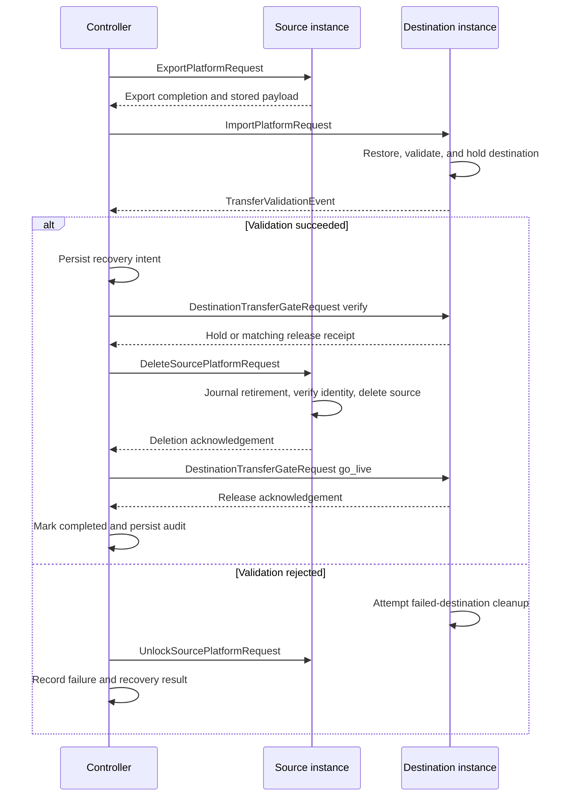

# Export, import, and transfer flow

The TypeScript instance plugin bridges Clusterio messages and Factorio RCON.
The Lua module runs inside Factorio callbacks. JavaScript promises and chunked
transport do not make Lua execution parallel. See [batching and timing](async-processing.md)
for stage boundaries, shared job scheduling, and measurements.

## Entry points

| Operation | Entry point | Source deletion |
|---|---|---|
| Transfer an existing platform | `StartPlatformTransferRequest` from web/CLI; `/transfer-platform` or gateway commands in game | Only after destination validation and hold confirmation |
| Standalone export | `ExportPlatformRequest`, `/export-platform`, or `/export-platform-file` | None |
| Uploaded import | `ImportUploadedExportRequest` or `ImportPlatformFromFileRequest` | None |
| Snapshot recovery | `ImportUploadedExportRequest` with stored snapshot and request identity | None; creates a separate import |

Message schemas are registered in [index.ts](../docker/seed-data/external_plugins/surface_export/index.ts)
and defined in [messages.ts](../docker/seed-data/external_plugins/surface_export/messages.ts).
The CLI definitions are in [control.ts](../docker/seed-data/external_plugins/surface_export/control.ts).

## Transfer handoff

[TransferOrchestrator](../docker/seed-data/external_plugins/surface_export/lib/transfer-orchestrator.ts)
coordinates admission, export retrieval, destination import, verdict handling, and
recovery. Admission reserves both participating instances. Lua import/export jobs
also share the instance's tick budget; these are separate limits.

```mermaid
sequenceDiagram
participant C as Controller
participant S as Source instance
participant D as Destination instance
C->>S: ExportPlatformRequest
S-->>C: Export completion and stored payload
C->>D: ImportPlatformRequest
D->>D: Restore, validate, and hold destination
D-->>C: TransferValidationEvent
alt Validation succeeded
  C->>C: Persist recovery intent
  C->>D: DestinationTransferGateRequest verify
  D-->>C: Hold or matching release receipt
  C->>S: DeleteSourcePlatformRequest
  S->>S: Journal retirement, verify identity, delete source
  S-->>C: Deletion acknowledgement
  C->>D: DestinationTransferGateRequest go_live
  D-->>C: Release acknowledgement
  C->>C: Mark completed and persist audit
else Validation rejected
  D->>D: Attempt failed-destination cleanup
  C->>S: UnlockSourcePlatformRequest
  C->>C: Record failure and recovery result
end
```

The diagram shows the successful request/reply boundaries. A refused or missing
cleanup reply leaves a retained uncertain operation; it does not advance to the
next irreversible step. A validation timeout is also an uncertain outcome, not a
negative verdict. [Handoff and recovery](TRANSFER_2PC.md) describes receipts,
journals, startup reconciliation, and save-reload limits.

## Source export

[ExportPipeline](../docker/seed-data/external_plugins/surface_export/module/core/export-pipeline.lua)
creates a job, protects the platform, captures supported state, and completes the
payload. Source cargo checks can reject the export before import starts. Entity,
tile, and codec scheduling boundaries are listed in the batching reference;
whole-payload native codec work remains synchronous when sectioned encoding is off.

Lua sends `surface_export_complete` with the export identity. The
[instance handler](../docker/seed-data/external_plugins/surface_export/instance.ts)
retrieves the payload through [LuaInterface](../docker/seed-data/external_plugins/surface_export/lib/lua-interface.ts)
and supplies the controller with `PlatformExportEvent`. Transfer association uses
the source instance and export-job identity; platform names are display labels.

Standalone exports release their transient export protection after capture.
Transfer protection remains tied to the handoff and its recovery state.

## Destination import

The instance bridge prepares and uploads the payload over RCON. Lua chunk sessions
and decoding feed [ImportPipeline](../docker/seed-data/external_plugins/surface_export/module/core/import-pipeline.lua).
Transport chunk size does not bound the cost of a subsequent whole-payload decode.

[Deserializer](../docker/seed-data/external_plugins/surface_export/module/core/deserializer.lua)
prepares the platform and restoration jobs. Generated starter cargo is cleared
before payload inventories are restored. Tile and entity work is followed by
[import completion](../docker/seed-data/external_plugins/surface_export/module/core/import-completion.lua):
belts, state and connections, inventories, held items, fluids, validation, and
activation or destination hold. Applicable phases yield through the shared scheduler.
Each belt lane group is restored and checked together; a large group can exceed
the configured batch target.

A transfer's successful destination remains held until the controller releases it.
Standalone import completion has no source-delete handshake. Import failures retain
diagnostic evidence and report cleanup failures separately from the cargo verdict.

## Snapshot recovery

[snapshot.ts](../docker/seed-data/external_plugins/surface_export/shared/snapshot.ts)
identifies importable payloads, including a supported black-box replay payload.
The controller creates a fresh import operation and replaces old transfer-routing
metadata. It does not reuse source-deletion authority or rewrite the original result.
Missing or expired payloads are unavailable, even when a history entry remains.

## Logs and clocks

The [transaction logger](../docker/seed-data/external_plugins/surface_export/lib/transaction-logger.ts)
retains summaries and detailed evidence under separate limits from stored payloads.
The web UI presents Clusterio and Lua timings on their own clocks. Exact tick
boundaries and batch counts are scheduling information, not millisecond geometry.
See [Transaction Logs](TRANSFER_LOGS.md) and [configuration](CONFIGURATION.md).

For local diagnosis, run
`node tools/clusterio/read-cluster-logs.mjs 'error|transfer|validation' 20 2000`.
Plugin JSON logs, Factorio output, and controller stdout are distinct sources.
The helper reports a read failure explicitly; an unread source is not evidence
that no error occurred.
