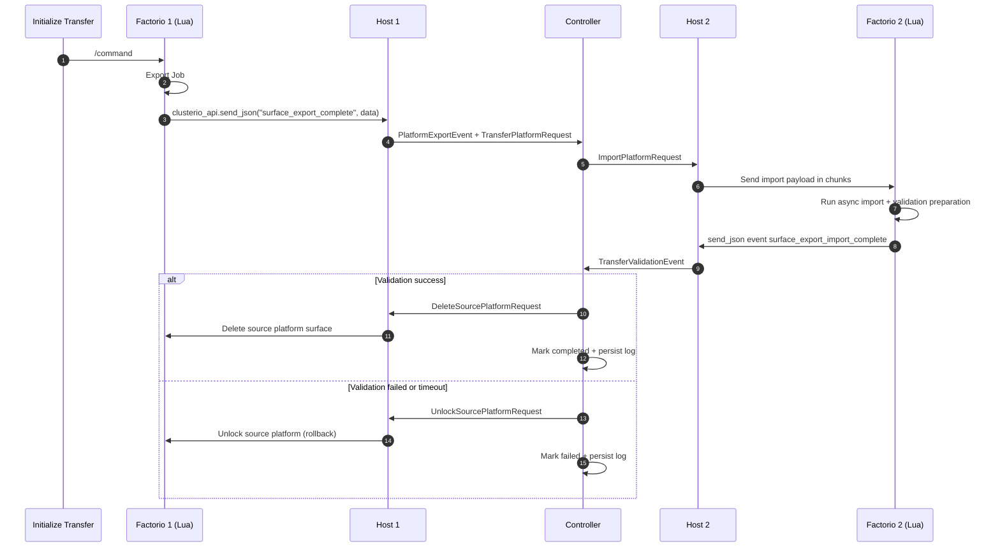
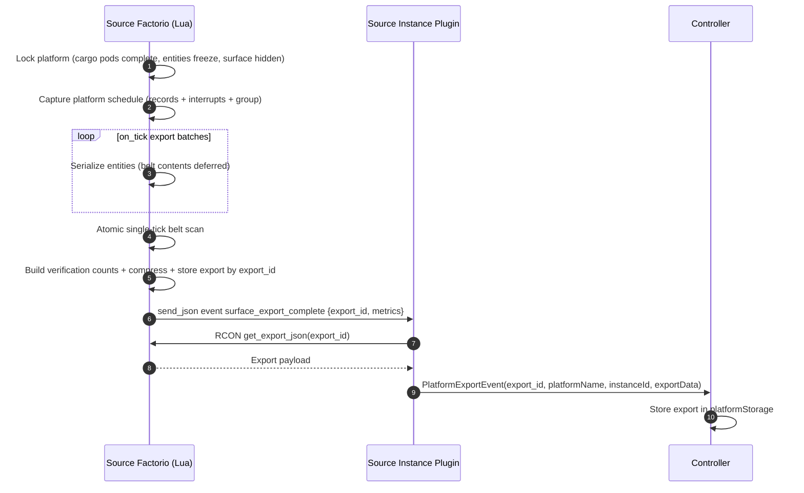
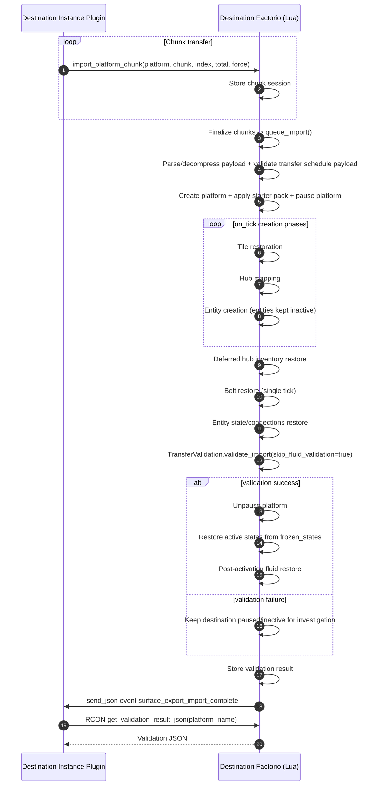

# Transfer Workflow Guide
Diagrams

## Entry Points
- In-game command: `/transfer-platform <platform_index> <destination_instance_id>`
- CLI (stored export): `npx clusterioctl surface-export transfer <exportId> <instanceId>`
- List exports: `npx clusterioctl surface-export list`

## Critical Invariants
1. Transfer Start (lock source platform)
   - completes in-flight cargo pod transitions
   - freezes entities (`entity.active = false`) and records `frozen_states`
   - hides/locks the surface so it can’t be modified during export
2. Export Job (scanning)
   - runs async export batches
   - performs atomic single-tick belt scan before final verification
   - stores compressed export data by `export_id`
3. Factorio -> Instance Plugin (Clusterio `send_json` event channel)
   - source Factorio emits `surface_export_complete`
   - instance plugin fetches full export payload via `get_export_json(export_id)`
4. Host -> Controller (Clusterio link messages)
   - E3a: `PlatformExportEvent` (store export)
   - E3b: `TransferPlatformRequest` (start transfer)
5. Validation + controller decision
   - I5a: `TransferValidationEvent` (destination plugin -> controller)
   - I5b: Controller decision (success / failed / timeout)
   - I5c-success: `DeleteSourcePlatformRequest` (cleanup path)
   - I5c-failure: `UnlockSourcePlatformRequest` (rollback path)

## 1) Canonical End-to-End Transfer Sequence

## 2) Export Internals (Zoom-In: E1 -> E3)
Scope: Source-side export work only. Starts when export is queued and ends when export data is stored on controller.

## 3) Import Internals (Zoom-In: I2 -> I5)
Scope: Destination-side import work only. Starts when payload chunking begins and ends when validation event is sent to controller.

## Validation Summary
- Item gains greater than 5 are failure.
- Very large item loss (greater than 95% and greater than 100 absolute) is failure.
- Unexpected item types above threshold are flagged.
- Fluid gains greater than 500 are failure.
- If expected fluid is greater than 1000 and actual is near zero, failure.
- Transfer path defers full fluid reconciliation until post-activation analysis.

## Transaction Log Flow
Common progression:
- `transfer_created` -> `import_started` -> `validation_received` -> `transfer_completed`
- Failure path includes rollback events (for example `rollback_attempt`, `rollback_success`, `transfer_failed`)
- Timeout path records `validation_timeout` then rollback

Scripts:
- `.\tools\list-transaction-logs.ps1`
- `.\tools\get-transaction-log.ps1`
- `.\tools\get-transaction-log.ps1 -TransferId <transfer_id>`
