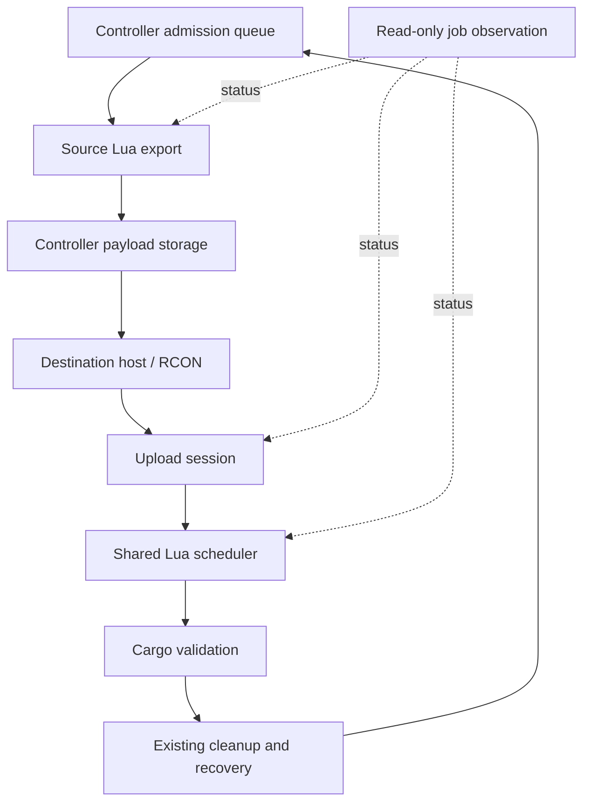

# Upload protocol and job observation

Temporary upload bytes, Lua scheduling, and platform ownership have different owners.
Begin and chunk acknowledgements report staging progress. A successful commit
acknowledgement identifies the accepted job; it does not confirm validation,
arrival, source deletion, or destination release.

## Upload ownership

`module/core/import-session.lua` owns receiving buffers and their job associations.
The internal protocol is version 1. Its operations are `initialize`, `begin`, `chunk`,
`commit`, `status`, and `abort`. The Node sender is `lib/upload-session.ts`.

An attempt has a sender startup epoch and increasing sequence number. It also carries
the operation ID; canonical transfer IDs and platform payload formats are unchanged.
Begin validates immutable metadata. Chunk calls cannot create attempts. Identical
chunks acknowledge existing progress; conflicting chunks are rejected.
The Node sender encodes the small request envelope as JSON and passes chunk bytes
separately in a delimiter-safe Lua string, avoiding a second JSON escape of the payload.

Commit records an admitting state and reserves a job ID before preparation. Successful
admission retains that association and releases the chunks. A repeated commit returns
the existing association. Exceptions retain a resulting job or an uncertain admission;
they do not imply that preparation had no side effects.

| Bound per instance | Limit |
|---|---:|
| Receiving or uncertain admitting attempts | 4 |
| Encoded bytes per upload | 512 MiB |
| Aggregate receiving reservations | 1 GiB |
| Bytes per chunk | 100,000 |
| Closed receipts without an active job | 512 |

`initialize` advertises `limits.chunkBytes`, `maxUploadBytes`, `maxBufferedBytes`,
and `maxSessions` from the Lua receiver. Node validates these positive integer limits,
uses the advertised chunk size and session cap, and rejects oversized encoded uploads
before sending `begin`. Lua still enforces admission and byte bounds. Missing or malformed
limits refuse initialization with a matching-deployment error. The handshake addition
does not change version-1 receipt storage or discard accepted jobs. A stopped or replaced
initialization cannot publish a late reply's limits or epoch.

Reservations use the declared encoded size. These limits do not bound decoded platform
memory. Capacity rejection never evicts a progressing upload. Pruned status is
**unavailable**; it cannot authorize importing the same attempt again. A sequence high
water mark prevents recreation of pruned attempts within the current sender epoch.

After an unsuccessful handler, the sender queries that attempt. Only a confirmed
receiving attempt can be aborted as buffer cleanup. Admitting and accepted attempts
belong to job observation and recovery. A bounded housekeeping pass retries unresolved
buffer cleanup every five seconds, with one pass outstanding. It cannot alter platforms,
locks, or accepted jobs.

The sender verifies the operation and attempt on receipts before accepting a job or
aborting bytes. Begin may return an existing attempt for the same operation; subsequent
calls must match that attempt. A foreign receipt remains uncertain and cannot supply a
job or authorize cleanup. Direct protocol probes must reconcile the Node sender before
resuming production requests, so the two callers do not allocate overlapping sequences.

Startup initializes uploads after recovery policy reconciliation. A new sender epoch
retires receiving buffers from the previous epoch, preserving accepted jobs and uncertain
admissions. Legacy unowned buffers are retired with a diagnostic. Deploy matching Node
and save-patched Lua together; the old implicit chunk endpoint rejects callers explicitly.

An admitting attempt is reconciled when its reserved job ID gains matching operation
evidence in a live job or retained result. It then becomes accepted and no longer uses
a receiving slot. Missing or mismatched evidence keeps the admission unresolved; neither
age nor a new sender epoch permits discarding its ownership record.
If capacity is exhausted, each unresolved admission logs its attempt ID and retained
error once. The diagnostic flag survives save/reload. Reporting does not reclaim the
slot, release a platform, or authorize another import.

## Status observation

`get_job_status_json` exposes persisted phase transitions, work cursors, result references,
and exact simulation tick observations. Controller requests name tracked jobs or operations;
there is no continuous historical scan. Responses distinguish queued, running, waiting,
completed, failed, interrupted, cleanup-pending, and unavailable state.

The existing `surface_export.transfer_validation_timeout_seconds` setting (default 30, range 5–120)
controls when delayed work is checked. It is not an upload timeout or a cancellation
deadline. Controller observation runs every five seconds, with at most one outstanding
status request per instance and 100 job references per request. Larger groups rotate.
Ownership recovery keeps its separate 30-second cadence.

| Observation | Meaning |
|---|---|
| Waiting in Lua queue | Accepted work has not received a scheduler step. |
| Waiting for a scheduled Lua phase | A persisted deferred-wait boundary is still ahead. |
| Lua job running | The job has received a scheduler step. The first observation establishes a baseline; later phase or work changes reset the no-progress threshold. |
| No progress observed | Running work has unchanged counters across that threshold. |
| Status unavailable | The instance, protocol response, job, or retained result cannot be verified. |
| Lua work completed; awaiting confirmed resolution | Job completion alone has not settled ownership. |

Scheduler visits, profiler readings, and log activity are not completed work. Invalid
zero or non-integer batch sizes are rejected. Observation deadlines use monotonic Node
time and restart after process restarts. Ticks remain scheduling data, never converted
into elapsed milliseconds.

A delayed or unavailable observation leaves the operation nonterminal and its involved
instances reserved. It does not write a completion timestamp, retry an import, delete a
platform, or unlock the source. Genuine composite validation results enter the existing
validation/recovery path. Original failures and subsequent recovery remain separate.

Record retention keeps unresolved operations and their retry guards in memory; the
100-record limit applies only to resolved history. After controller restart, standalone
exports complete only when their canonical source artifact is stored, or fail on explicit
source failure evidence. A completed Lua job alone does not prove the download is available.
The confirmation timestamp is recorded without reconstructing a duration across the restart.
An explicit failure to send the Lua export notification is retained as a failed job
result. The controller can then resolve the failed request through its existing failure
path. A completed job with delivery still in flight is not treated as proof of failure.

For a tracked source job observed as completed without a stored artifact, the controller
issues a read-only `ReadExportRequest` for that job's existing Lua export cache entry.
It reads at most once per operation and observed instance startup epoch during a controller
process lifetime. The instance checks the epoch before and after retrieval. The controller
checks the response identity and retains the first artifact if the original push arrives too.
This neither reruns export nor dispatches import; the original transfer flow resumes when
storage becomes available. Missing data or a failed read leaves the operation protected with
“Export completed; payload unavailable” and the read error. A later push can still resolve it;
a new instance epoch or controller restart permits another read. Cache data lost with an
unsaved world cannot be reconstructed by this path. Export metrics that existed only in the
lost notification remain unavailable.

Unresolved records remain eligible for status observation. Online instances therefore
continue receiving bounded status requests until resolution, even when the original
result was lost. Known offline instances produce an unavailable observation without an
RCON request. Unavailable reads do not reset the last confirmed progress baseline.

Unfinished transfer destinations are hidden and paused before yielding. Temporary hiding
is not a validated destination hold. Transfer-owned source locks do not expire solely
because time passed; explicit resolution is required. Standalone orphan export locks
retain their existing cleanup behavior.

Clusterio 2.0.0-alpha.27 supplies connection resume and buffered message resend. Its pinned
RCON command timeout is 200 seconds. This protocol adds neither a competing upload timeout
nor automatic import replay after session loss.

## Verify a protocol change

The [upload-status fixture](../../tests/manual/transfer-reliability/README.md)
uses disposable Docker resources. It exercises duplicate/conflicting chunks,
uncertain admission, queue waits, missing notifications and process restarts.
The runner's selected cases and raw results determine the scope of a pass.
Capacity tests reserve declared sizes; they do not allocate a full 1 GiB payload.
Transport fault injection is distinct from actual engine and save observations.

Read [testing](testing.md) before invoking a live fixture and
[timing](../technical/timing.md) before interpreting its elapsed values.
