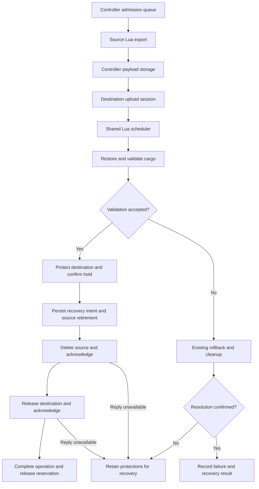

# How a transfer works

Clusterio supplies process management, authenticated messaging, RCON access and
save patching. Surface Export adds platform serialization, restoration, cargo
validation, transfer ownership and its web interface. The gateway mod supplies
space-map prototypes; the save-patched Lua module supplies their behavior.

## From request to usable destination

The diagram shows a controller-requested transfer. A source-initiated export
reaches controller observation when its exported payload arrives.

The admission queue reserves the participating instances. An upload session owns
temporary bytes. The Lua scheduler advances jobs. Validation and identity-bound
recovery decide whether ownership can change. Observing a timeout or a missing
status grants none of that authority.

## Identity and protection

A persistent platform identifier distinguishes a platform across save/restart
operations. Its current force, platform index and surface index locate the object;
the display name does not authorize deletion. Transfer messages carry the
operation and job identity as well. Canonical transfer IDs associate the source
instance with its export job, and new jobs include a startup epoch to avoid reusing
IDs when an older save is loaded.

Source locks and destination holds temporarily restrict access and disable
selected entity types. They do not freeze every entity or stop belt simulation.
Saved operational state is restored through the matching release path.
Transfer-owned locks and unresolved destination holds do not expire merely because
time passed. The standalone export-lock expiry path excludes active jobs and
transfer-owned locks.

The controller persists recovery intent before requesting irreversible cleanup.
The source instance writes a retirement journal outside its Factorio save before
deletion. A retirement intent is not an acknowledgement that deletion happened.
Lua receipts answer repeated deletion/release requests when matching evidence
remains. Missing, pruned or mismatched evidence is uncertainty, not success.

## Copies and restoration

A standalone export retains the source. A standalone import creates a copy.
Snapshot recovery is a new import with new routing metadata; it does not replay a
completed transfer's source deletion. Retaining a download therefore does not
authorize transferring that snapshot again under the old canonical ID.

Loading an earlier save can conflict with later transfer history. The configured
[save-recovery policy](../admins/recovery.md#choose-how-restored-saves-are-treated)
decides whether a completed transfer's restored source stays protected or is
accepted with a fresh identity. Active and unresolved handoffs remain protected
under both policies.

## Evidence and limits

The implementation is in the plugin's
[transfer orchestrator](../../docker/seed-data/external_plugins/surface_export/lib/transfer-orchestrator.ts),
[source lock](../../docker/seed-data/external_plugins/surface_export/module/utils/surface-lock.lua)
and [source recovery](../../docker/seed-data/external_plugins/surface_export/module/core/source-recovery.lua).
The [deletion-failure fixture](../../tests/integration/transfer-cleanup/README.md)
retains the original two-usable-copy failure and subsequent independent checks.
The [manual recovery lab](../../tests/manual/transfer-reliability/README.md)
separately records crashes, lost replies and older-save cases.

These tests cover their recorded fixtures and failure boundaries. They do not
establish arbitrary crash safety, compatibility with every mod, or recovery from
loss of every matching world and journal. See [records and repair](records.md).
