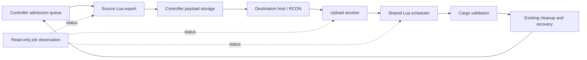

# Upload sessions and Lua job status

Temporary upload bytes, Lua scheduling, and platform ownership have different owners.
An upload acknowledgement confirms admission to a job. It does not confirm validation,
arrival, source deletion, or destination release.



## Upload ownership

`module/core/import-session.lua` owns receiving buffers and their job associations.
The internal protocol is version 1. Its operations are `initialize`, `begin`, `chunk`,
`commit`, `status`, and `abort`. The Node sender is `lib/upload-session.ts`.

An attempt has a sender startup epoch and increasing sequence number. It also carries
the operation ID; canonical transfer IDs and platform payload formats are unchanged.
Begin validates immutable metadata. Chunk calls cannot create attempts. Identical
chunks acknowledge existing progress; conflicting chunks are rejected.

Commit records an admitting state and reserves a job ID before preparation. Successful
admission retains that association and releases the chunks. A repeated commit returns
the existing association. Exceptions retain a resulting job or an uncertain admission;
they do not imply that preparation had no side effects.

| Bound per instance | Limit |
|---|---:|
| Receiving or uncertain admitting attempts | 4 |
| Encoded bytes per upload | 512 MiB |
| Aggregate receiving reservations | 1 GiB |
| Bytes per chunk | 100,000 |
| Closed receipts without an active job | 512 |

Reservations use the declared encoded size. These limits do not bound decoded platform
memory. Capacity rejection never evicts a progressing upload. Pruned status is
**unavailable**; it cannot authorize importing the same attempt again. A sequence high
water mark prevents recreation of pruned attempts within the current sender epoch.

After an unsuccessful handler, the sender queries that attempt. Only a confirmed
receiving attempt can be aborted as buffer cleanup. Admitting and accepted attempts
belong to job observation and recovery. A bounded housekeeping pass retries unresolved
buffer cleanup every five seconds, with one pass outstanding. It cannot alter platforms,
locks, or accepted jobs.

Startup initializes uploads after recovery policy reconciliation. A new sender epoch
retires receiving buffers from the previous epoch, preserving accepted jobs and uncertain
admissions. Legacy unowned buffers are retired with a diagnostic. Deploy matching Node
and save-patched Lua together; the old implicit chunk endpoint rejects callers explicitly.

## Status observation

`get_job_status_json` exposes persisted phase transitions, work cursors, result references,
and exact simulation tick observations. Controller requests name tracked jobs or operations;
there is no continuous historical scan. Responses distinguish queued, running, waiting,
completed, failed, interrupted, cleanup-pending, and unavailable state.

The existing `surface_export.transfer_timeout_seconds` setting (default 30, range 5–120)
now controls when delayed work is checked. It is not an upload timeout or a cancellation
deadline. Controller observation runs every five seconds, with at most one outstanding
status request per instance and 100 job references per request. Larger groups rotate.
Ownership recovery keeps its separate 30-second cadence.

| Observation | Meaning |
|---|---|
| Waiting in Lua queue | Accepted work has not received a scheduler step. |
| Waiting for a scheduled Lua phase | A persisted deferred-wait boundary is still ahead. |
| Lua work progressing | Persisted phase or work counters changed within the observation threshold. |
| No progress observed | Running work has unchanged counters across that threshold. |
| Status unavailable | The instance, protocol response, job, or retained result cannot be verified. |
| Lua work completed; awaiting confirmed resolution | Job completion alone has not settled ownership. |

Scheduler visits, profiler readings, and log activity are not completed work. Invalid
zero or non-integer batch sizes are rejected. Observation deadlines use monotonic Node
time and restart after process restarts. Ticks remain scheduling data, never converted
into elapsed milliseconds.

A delayed or unavailable observation leaves the operation nonterminal and its involved
instances reserved. It does not write a completion timestamp, retry an import, delete a
platform, or unlock the source. Genuine composite validation results enter the existing
validation/recovery path. Original failures and subsequent recovery remain separate.

Unfinished transfer destinations are hidden and paused before yielding. Temporary hiding
is not a validated destination hold. Transfer-owned source locks do not expire solely
because time passed; explicit resolution is required. Standalone orphan export locks
retain their existing cleanup behavior.

Clusterio 2.0.0-alpha.27 supplies connection resume and buffered message resend. Its pinned
RCON command timeout is 200 seconds. This protocol adds neither a competing upload timeout
nor automatic import replay after session loss.

## Verification tooling

Build a candidate outside the development runtime, then invoke the disposable fixture:

```powershell
./tools/clusterio/build-plugin.ps1 all -OutputDirectory ci-artifacts/upload-status-dist
./tools/clusterio/build-plugin.ps1 test -OutputDirectory ci-artifacts/upload-status-dist
node tests/manual/transfer-reliability/upload-status.mjs ci-artifacts/upload-status-dist
```

The fixture creates labelled `se-manual-upload-*` resources and removes only those
resources. Its `ci-artifacts/<run>/result.json` records the candidate hash, pinned engine,
case outcomes, physical observations, and cleanup result. `commands.jsonl` and the browser
capture accompany the result. A nonzero exit is not a passing acceptance result.

Scheduler pauses and lost replies are injected at module/transport boundaries. Cargo,
Factorio execution, saves, and controller restarts are real. Capacity cases reserve
declared sizes without allocating a 1 GiB test payload. Unit tests separately exercise
receipt pruning and malformed protocol calls. None of these tests establishes a universal
memory, throughput, or crash-safety guarantee.
